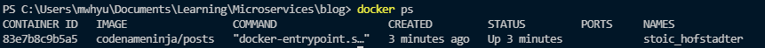

## Commands


so let's go back to our posts directory and rebuild our image with a new name.

```bash
docker build -t codenameninja/posts .

................................

docker run codenameninja/posts
```

running a terminal/shell in posts container

```bash
docker run -it codenameninja/posts sh
```
see a list of running docker containers 

```bash
docker ps
```


How to execute a shell in a running container 

```bash
docker exec -it 83e7b8c9b5a5 sh
```

now finally we might want to see the logs of our container

```bash
docker logs 83e7b8c9b5a5
```   