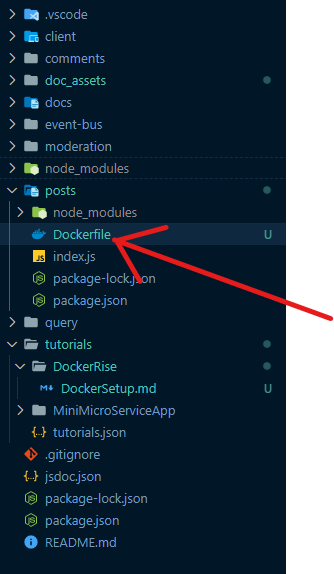
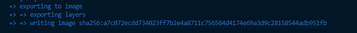

## Setup

We are going to start by creating a `Dockerfile` in the root directory of our `Posts` Service.



### Dockerfile

Specify Base Image


```Dockerfile
FROM node:alpine

WORKDIR /app
COPY package.json ./
RUN npm install
COPY ./ ./

CMD ["npm", "start"]
```

Now, one other thing we're going to do really quickly, we usually don't want to include any install dependencies that are on our local machine.

So in our case, that would be the node modules folder in order to make sure that we don't send all
those dependencies over during the image building process.

We're going to create a file inside this post directory.
Called `.dockerignore`, and we're going to add the following line:
`node_modules`

### build docker image  

```bash
cd ./posts

docker build .
```

You should see a new image being created.
and the image key



## Run container with image

`docker run a7c072ecdd734023ff7b2e4a8711c756564d4174e69a3d9c28158544adb951fb`

