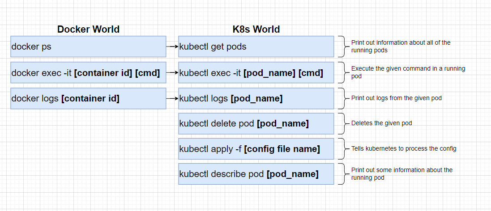

## Add Config file to Image 

To get started we need to rebuild our docker image in our posts directory, but this time we are going to tell the image identify the configuration file.

```bash

docker build -t codenameninja/posts:0.0.1 .

```
Now let's create a new directory in the root of our project called `infra` and inside that folder we are going to create another folder called `k8s` and inside that folder we are going to create a file called `posts.yaml`


now let's write out our config

```yml
apiVersion: v1
kind: Pod
metadata:
  name: posts-api
spec:
  containers:
  - name: posts-api
    image: codenameninja/posts:0.0.1

```


now let's navigate to our `posts.yml` file in our terminal aand run it with 

`kubectl apply -f posts.yml`


----

### Kubectl commands to interact with pods



