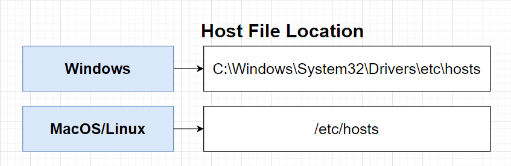
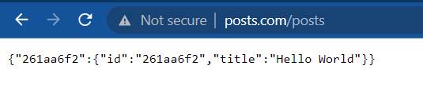

Creating a Ingress Config File.

Let's navigate to our k8s directory and create a file called `ingress.yml` file.

```bash

cd /infra/k8s

touch ingress-srv.yml

```

inside this file, copy and paste the following.

```yml
apiVersion: networking.k8s.io/v1
kind: Ingress
metadata:
  name: ingress-srv
  annotations:
    kubernetes.io/ingress.class: nginx
spec:
  rules:
    - host: posts.com
      http:
        paths:
          - path: /posts
            pathType: Prefix
            backend:
              service:
                name: posts-clusterip-srv
                port:
                  number: 4000
```
Once done pasting in the yml config, we are then going to apply this file.

```bash
> kubectl apply -f ingress-srv.yml
ingress.networking.k8s.io/ingress-srv created
```

### Host File Tweaking.

> How to check if something is blocking port 80
> `netstat -aon | findstr :80`



```bash
cd C:\Windows\System32\drivers\etc>
notepad hosts
```

at the end of the file. at the following at the end of the file.

```txt
127.0.0.1 posts.com
```

Then in your browser, navigate to the followng, and you should see our posts object, from when we made a post previously.

