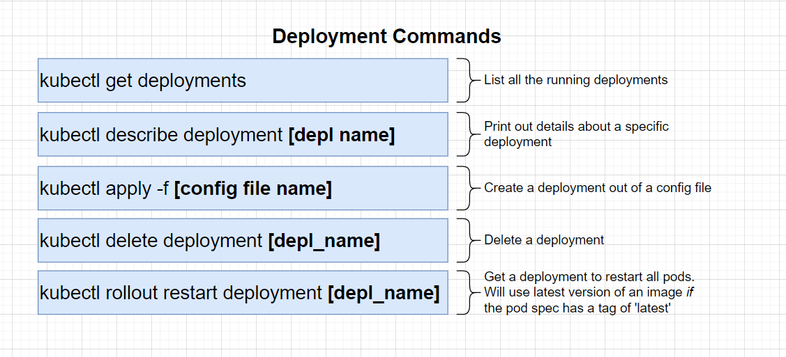

Firstly we want to remove our `posts.yml` file and start fresh with a new file called `posts-depl.yml` 

and in this config we are going to configure deployment, and in this config we are going to spec how many pods we want to run and point it to our posts image

```yml
apiVersion: apps/v1
kind: Deployment
metadata:
  name: posts-depl
spec:
  replicas: 1
  selector:
    matchLabels:
      app: posts
  template:
    metadata:
      labels:
        app: posts
    spec:
      containers:
      - name: posts
        image: codenameninja/posts:0.0.1
```

### Kubernetes Deployment Commands

