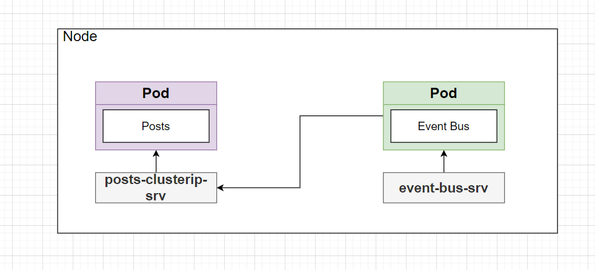
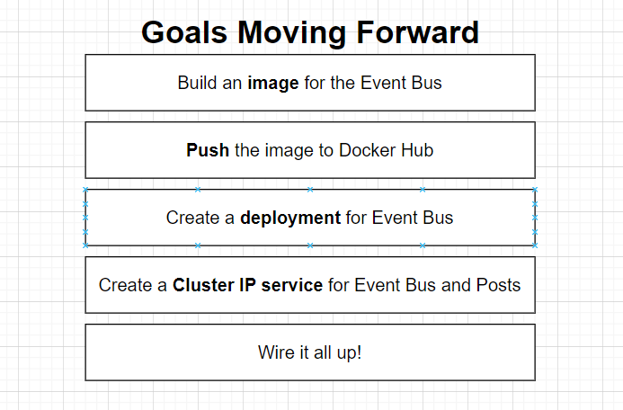

Remember that the goal of a cluster IP service is to expose a pod to other pods inside the cluster.

To better explore a cluster IP, I want to give you a quick reminder on how parts of our application

are working right now, but present we've got that post project.

Any time someone tries to create a post, we are sending a request over to the event bus and the event

bus hopefully is going to emit that event or kind of broadcast that event to everything else inside of app, including back over to post.

So let's try to create a new pod that is going to run event bus, we're then going to set up some services

to allow posts and event bus to communicate with each other.

Let me show you a diagram to help you understand what we're really going to do here.



### Goals Moving Forward



### Getting Started

Let's start by creating a new image for the event bus

```bash
cd /event-bus
docker build -t codenameninja/event-bus .
```

Great, now let's push our newly created image to `Docker Hub`

```bash
> docker push codenameninja/event-bus

Using default tag: latest
The push refers to repository [docker.io/codenameninja/event-bus]
f350d9d2402f: Pushed
14c350038b69: Pushed
41d2e3a5d3c9: Pushed
b183e8dc895f: Mounted from codenameninja/posts
49281578ca1a: Mounted from codenameninja/posts
c833154f20e9: Mounted from codenameninja/posts
5be440dc5019: Mounted from codenameninja/posts
8d3ac3489996: Mounted from codenameninja/posts
latest: digest: sha256:181bef3fdb5380c5fa7ff3bae6157b4387b43bb2f362b61ff4a4d3cc6db01f51 size: 1992

```

Now let's create a Deployment script for our `event-bus` image.

Create a file in /infra/k8s/event-bus-depl.yml

and inside, we are going to copy and paste our `posts-depl.yml` file and paste it in this file and change what needs to be changed to point to event-bus

```yml
apiVersion: apps/v1
kind: Deployment
metadata:
  name: event-bus-depl
spec:
  replicas: 1
  selector:
    matchLabels:
      app: event-bus
  template:
    metadata:
      labels:
        app: event-bus
    spec:
      containers:
        - name: event-bus
          image: codenameninja/event-bus
```
Now we can apply our deployment with `kubectl`

```bash
cd /infra/k8s
> kubectl apply -f event-bus-depl.yml
deployment.apps/event-bus-depl created

```

if we list our pods, we should see our event-bus
```bash
> k get pods
NAME                            READY   STATUS    RESTARTS   AGE  
event-bus-depl-865d5f6d-n86dd   1/1     Running   0          46s  
posts-depl-5f6cf6df9b-rbnfq     1/1     Running   2          2d21h
```
---
### Adding CluserIP Service

So in our `event-bus-deply.yml` we are going to add our cluser IP service to our deployment.

at the bottom of the deployment config we are going to add 

```yml
---

```

so we can add multiple configs.

The configuration that we are going to write out, is going to look alot like the `posts-srv.yml` file.

```yml
apiVersion: apps/v1
kind: Deployment
metadata:
  name: event-bus-depl
spec:
  replicas: 1
  selector:
    matchLabels:
      app: event-bus
  template:
    metadata:
      labels:
        app: event-bus
    spec:
      containers:
      - name: event-bus
        image: codenameninja/event-bus

---

apiVersion: v1
kind: Service
metadata:
  name: event-bus-srv
  labels:
    app: event-bus-srv
spec:
  type: ClusterIP #Optional
  selector:
    app: event-bus
  ports:  # List of ports to be exposed
    - name: event-bus 
      protocol: TCP
      port: 4005
      targetPort: 4005
```

now once we are done with that, we can try applying our config file again to update our deployment.

```bash

> kubectl apply -f event-bus-depl.yml
deployment.apps/event-bus-depl unchanged
service/event-bus-srv created
```

```bash
> k get services
NAME            TYPE        CLUSTER-IP       EXTERNAL-IP   PORT(S)          AGE
event-bus-srv   ClusterIP   10.104.110.16    <none>        4005/TCP         63s
kubernetes      ClusterIP   10.96.0.1        <none>        443/TCP          3d19h
posts-srv       NodePort    10.111.116.230   <none>        4000:30290/TCP   2d1h

```

**Repeat the process for our posts deployment**

```yml
apiVersion: apps/v1
kind: Deployment
metadata:
  name: posts-depl
spec:
  replicas: 1
  selector:
    matchLabels:
      app: posts
  template:
    metadata:
      labels:
        app: posts
    spec:
      containers:
      - name: posts
        image: codenameninja/posts
---

apiVersion: v1
kind: Service
metadata:
  name: posts-clusterip-srv
  labels:
    app: posts-clusterip-srv
spec:
  type: ClusterIP #Optional
  selector:
    app: posts
  ports:  # List of ports to be exposed
    - name: posts 
      protocol: TCP
      port: 4000
      targetPort: 4000
```

```bash
> k apply -f posts-depl.yml                        
deployment.apps/posts-depl unchanged
service/posts-clusterip-srv created

> k get services
NAME                  TYPE        CLUSTER-IP       EXTERNAL-IP   PORT(S)          AGE
event-bus-srv         ClusterIP   10.104.110.16    <none>        4005/TCP         5m31s
kubernetes            ClusterIP   10.96.0.1        <none>        443/TCP          3d19h
posts-clusterip-srv   ClusterIP   10.96.8.248      <none>        4000/TCP         16s
posts-srv             NodePort    10.111.116.230   <none>        4000:30290/TCP   2d1h
```