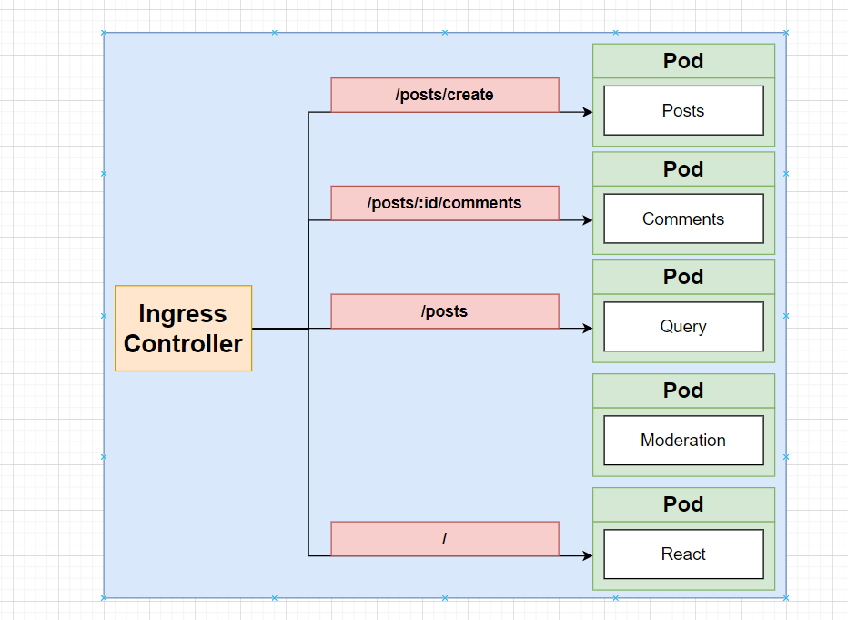

Here is a diagram of a list of routes that we need to service



One problem, the Ingress Controller, cannot handle requests based on **METHOD** but only on the **PATH**

the issue we have is that we have a **GET** & **POST** Request to **/posts**

to fix this, we need to change our paths for posts, to the following: 

```
/posts/create

```
for creating a post.
and the GET request for `/posts` can remain the same.

So to make this a reality we need to update both our client app and our posts service.

Once we have updated our Client App and our Posts Service, we can update their images and rollout a restart for the deployment.

### Routing Configuration

Navigate to our `ingress-srv.yml` file and update it to the following.

```yml
apiVersion: networking.k8s.io/v1
kind: Ingress
metadata:
  name: ingress-srv
  annotations:
    kubernetes.io/ingress.class: nginx
    nginx.ingress.kubernetes.io/use-regex: 'true'
spec:
  rules:
    - host: posts.com
      http:
        paths:
          - path: /posts/create
            pathType: Prefix
            backend:
              service:
                name: posts-clusterip-srv
                port:
                  number: 4000
          - path: /posts
            pathType: Prefix
            backend:
              service:
                name: query-srv
                port:
                  number: 4002
          - path: /posts/?(.*)/comments
            pathType: Prefix
            backend:
              service:
                name: comments-srv
                port:
                  number: 4001
          - path: /?(.*)
            pathType: Prefix
            backend:
              service:
                name: client-srv
                port:
                  number: 3000

```

```bash
> k apply -f ingress-srv.yml
ingress.networking.k8s.io/ingress-srv configured
```