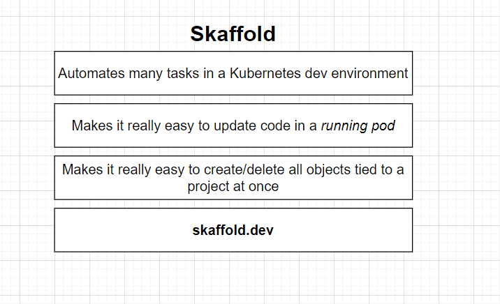

installing **Skaffold**

```bash
choco install -y skaffold
```
### Setup

Let's start by creating a config file for our Skaffold Setup .

in the root directory, let's create file called `skaffold.yaml`

the config is going to look like this: 

```yml
apiVersion: skaffold/v2alpha3
kind: Config
deploy:
  kubectl:
    manifests:
      - ./infra/k8s/*
build:
  local:
    push: false #disables Scaffold from pushing to docker hub
  artifacts:
    - image: codenameninja/client
      context: client
      docker:
        dockerfile: Dockerfile
      sync:
        manual:
          - src: "src/**/*.js"
            dest: .
    - image: codenameninja/comments
      context: comments
      docker:
        dockerfile: Dockerfile
      sync:
        manual:
          - src: "*.js"
            dest: .
    - image: codenameninja/posts
      context: posts
      docker:
        dockerfile: Dockerfile
      sync:
        manual:
          - src: "*.js"
            dest: .
    - image: codenameninja/query
      context: query
      docker:
        dockerfile: Dockerfile
      sync:
        manual:
          - src: "*.js"
            dest: .
    - image: codenameninja/moderation
      context: moderation
      docker:
        dockerfile: Dockerfile
      sync:
        manual:
          - src: "*.js"
            dest: .
    - image: codenameninja/event-bus
      context: event-bus
      docker:
        dockerfile: Dockerfile
      sync:
        manual:
          - src: "*.js"
            dest: .
      
```

So by adding in this manifest line, we are telling Scaffolded that we wanted to watch all these different
Yaml files.

Any time that we make a change to one of those files, Scaffold is going to automatically re-apply that
config file to our Kubernetes Cluster.

So in other words, it's going to save us from the hassle of having to run.

`kubectl apply -f` over and over and over again.

Any time that we create a file or make a change to a file.
By listing out manifests, Scaffold is also going to make sure to it creates all these or appliances,
any time we start scaffold up, it's also going to delete all the config or all the objects, associate
these config files whenever we stop scaffold as well.

So in total, this is really doing three things.

We start up scaffold apply these files when we make a change, apply these files whenever we stop scaffold,
find all the objects related to these config files and delete them.
Don't delete the files themselves, just delete the objects that are created by them inside of our clarinettist
cluster.

### First Skaffold Startup

navigate to root and then statup skaffold with the following command:

```bash
skaffold dev
```

> if you get any errors, try running it again.

if you want to clean up after you exit skaffold command. use this.

> `skaffold delete`