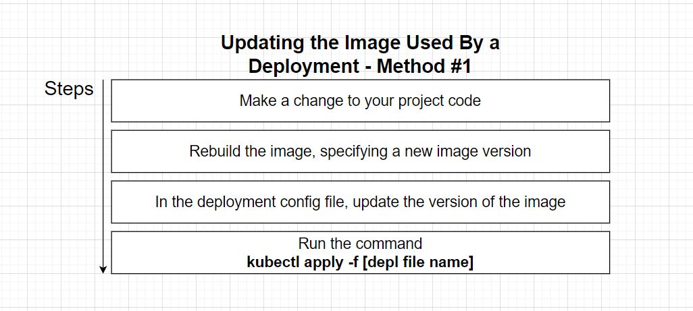
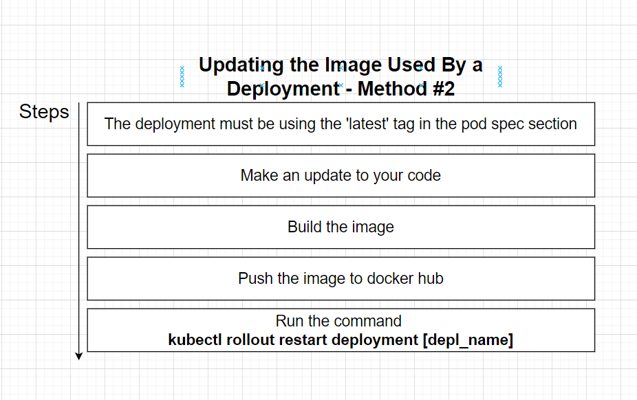

Firstly let's start by making a change to our `Posts` Application. This

Navigate to `index.js` in our `Posts` Folder, and add another `console.log()` inside the call when our app starts serving.

```js
app.listen(4000, () => {
  console.log("v.0.0.2");
  console.log("Listening on 4000");
});
```

Now let's go back to our `terminal` and navigate to our `posts` project and _rebuild_ our _docker_ image, but this time with a new tag.

`docker build -t codenameninja/posts:0.0.2 .`

#### Update Deployment Config File

```yml
spec:
  containers:
    - name: posts
      image: codenameninja/posts:0.0.2
```

Next we need to tell Kubernetes that our config file has changed, by trying to apply the config file again.

So let's go to our `/infra/k8s` directory and run the following command:

```bash
k apply -f posts-depl.yml

```

You should see an output like this:

```bash

C:\Users\mwhyu\Documents\Learning\Microservices\blog\infra\k8s>k apply -f posts-depl.yml
deployment.apps/posts-depl configured

```

notice how it says _configured_ instead of _created_

## Preferred Method of Updating Deployments



let's change our config file again, but this time remove the tag number, and instead use the `latest` tag, or we can just not specify a tag and Kubernetes will automatically assume we are using the latest version of the image.

```yml
spec:
  containers:
    - name: posts
      image: codenameninja/posts
```

next let's apply the config again. 

Now let's make another change to our `index.js`

```js
app.listen(4000, () => {
  console.log("v.0.2.5");
  console.log("Listening on 4000");
});

```

Now rebuild the `posts` image. 

`docker build -t codenameninja/posts .`

and then push to docker hub

```bash
docker push codenameninja/posts
```

We should see an output like this:

```bash
Using default tag: latest
The push refers to repository [docker.io/codenameninja/posts]
5d73725f6bbc: Pushed
a04ae7f38073: Pushed
1867b73ccc92: Pushed
b183e8dc895f: Pushed
49281578ca1a: Mounted from library/node
c833154f20e9: Mounted from library/node
5be440dc5019: Mounted from library/node
8d3ac3489996: Mounted from library/node
latest: digest: sha256:774805eb544c76205c63fdd3e13883e53983df5972d990b336cc87245b7068fa size: 1992

```

Okay now our latest version is in Docker Hub. 

Now we want to tell our deployment to use that latest version.

```bash

k get deployments

NAME         READY   UP-TO-DATE   AVAILABLE   AGE    
posts-depl   1/1     1            1           164m   


k rollout restart deployment posts-depl

> deployment.apps/posts-depl restarted


```

Now let's Verify

```bash
k get pods

NAME                          READY   STATUS    RESTARTS   AGE
posts-depl-5f6cf6df9b-rbnfq   1/1     Running   0          57s

k logs posts-depl-5f6cf6df9b-rbnfq

> posts@1.0.0 start
> nodemon index.js

[nodemon] 2.0.15
[nodemon] to restart at any time, enter `rs`
[nodemon] watching path(s): *.*
[nodemon] watching extensions: js,mjs,json
[nodemon] starting `node index.js`
v.0.2.5
Listening on 4000
```

And there you go, we can see our changes