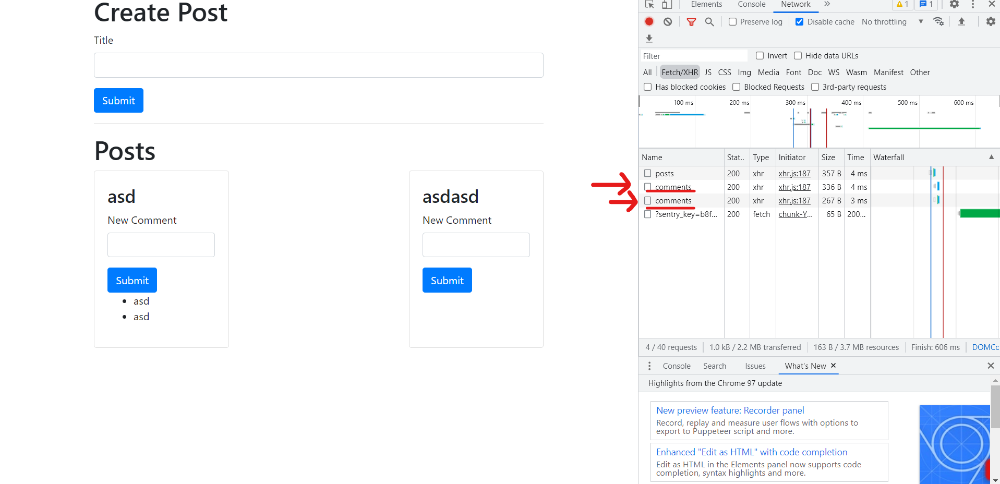

### Let's scaffold a Post and Comments App.

Post and Comments App is a simple app that allows users to create posts and comments.

#### PostCreate and PostList

PostCreate
Post to our posts service and create a post

```js
import React, { useState } from "react";
import axios from "axios";

const PostCreate = () => {
  const [title, setTitle] = useState("");
  const onSubmit = async (event) => {
    event.preventDefault();
    await axios.post("http://localhost:4000/posts", {
      title: title,
    });

    setTitle("");
  };
  return (
    <div>
      <form onSubmit={onSubmit}>
        <div className="form-group">
          <label>Title</label>
          <input
            value={title}
            onChange={(e) => setTitle(e.target.value)}
            type="text"
            className="form-control"
          />
        </div>
        <button className="btn btn-primary">Submit</button>
      </form>
    </div>
  );
};

export default PostCreate;
```

PostList
Responsible for fetching posts from the posts service and rendering them in a list

```js
import React, { useState, useEffect } from "react";
import axios from "axios";
import CommentCreate from "./CommentCreate";
import CommentList from "./CommentList";
const PostList = () => {
  const [posts, setPosts] = useState({});
  const fetchPosts = async () => {
    const res = await axios.get("http://localhost:4000/posts");

    setPosts(res.data);
  };

  useEffect(() => {
    fetchPosts();
  }, []);

  const renderPosts = Object.values(posts).map((post) => {
    return (
      <div
        key={post.id}
        className="card"
        style={{ width: " 30%", marginBottom: "20px" }}
      >
        <div className="card-body">
          <h3>{post.title}</h3>
          <CommentCreate postId={post.id} />
          <CommentList postId={post.id} />
        </div>
      </div>
    );
  });
  return (
    <div className="d-flex flex-row flex-wrap justify-content-between">
      {renderPosts}
    </div>
  );
};

export default PostList;
```

#### CommentCreate and CommentList

CommentCreate
Responsible for creating comments by postId

```js
import React, { useState } from "react";
import axios from "axios";
const CommentCreate = ({ postId }) => {
  const [content, setContent] = useState("");
  const onSubmit = async (event) => {
    event.preventDefault();
    await axios.post(`http://localhost:4001/posts/${postId}/comments`, {
      content,
    });
    setContent("");
  };
  return (
    <div>
      <form onSubmit={onSubmit}>
        <div className="form-group">
          <label htmlFor="comment">New Comment</label>
          <input
            value={content}
            onChange={(e) => setContent(e.target.value)}
            type="text"
            className="form-control"
            name="comment"
          />
        </div>
        <button className="btn btn-primary">Submit</button>
      </form>
    </div>
  );
};

export default CommentCreate;
```

CommentList
Responsible for fetching comments by postId

```js
import React, { useState, useEffect } from "react";
import axios from "axios";

const CommentList = ({ postId }) => {
  //fetch comments from post
  const [comments, setComments] = useState([]);
  const fetchComments = async () => {
    const res = await axios.get(
      `http://localhost:4001/posts/${postId}/comments`
    );
    setComments(res.data);
  };

  useEffect(() => {
    fetchComments();
  }, []);

  //render comments
  const renderComments = comments.map((comment) => {
    return <li key={comment.id}>{comment.content}</li>;
  });

  return <ul>{renderComments}</ul>;
};

export default CommentList;
```


### App.js

Okay great, we have completed the basic layout of our Posts & comments logic, now lets stitch them together in our App.js file

```js
import React from "react";
import PostCreate from "./PostCreate";
import PostList from "./PostList";
const App = () => {
  return (
    <div className="container">
      <h1>Create Post</h1>
      <PostCreate />
      <hr />
      <h1>Posts</h1>
      <PostList />
    </div>
  );
};

export default App;


```

#### Finish App



Notice how we send a seperate request for each comment that we have stored. 

This is the topic of our next discussion