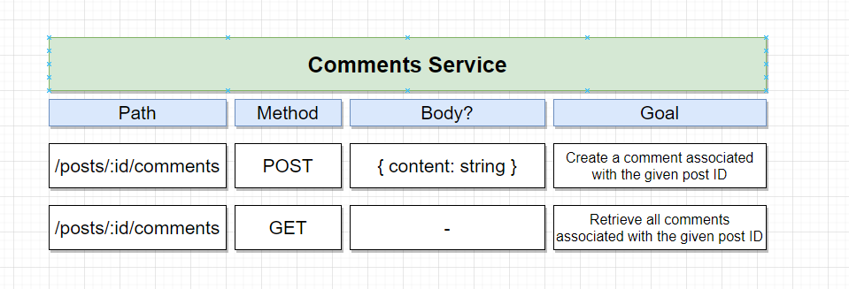
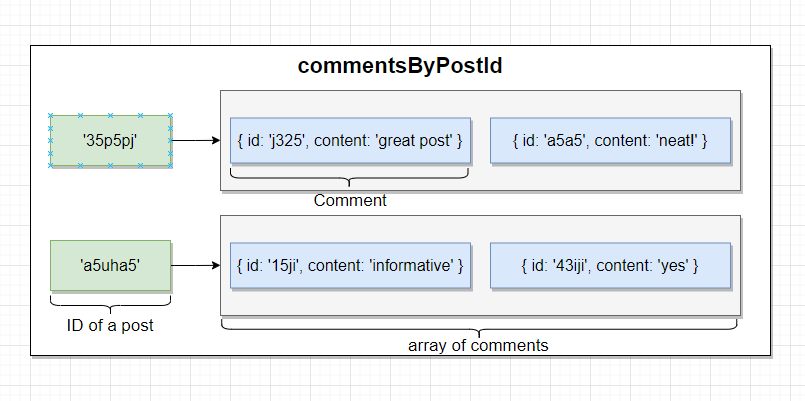
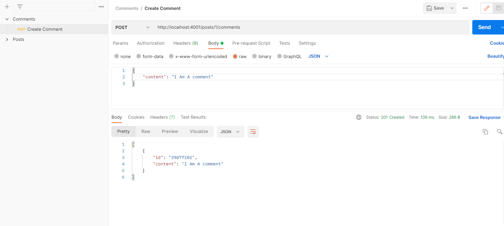
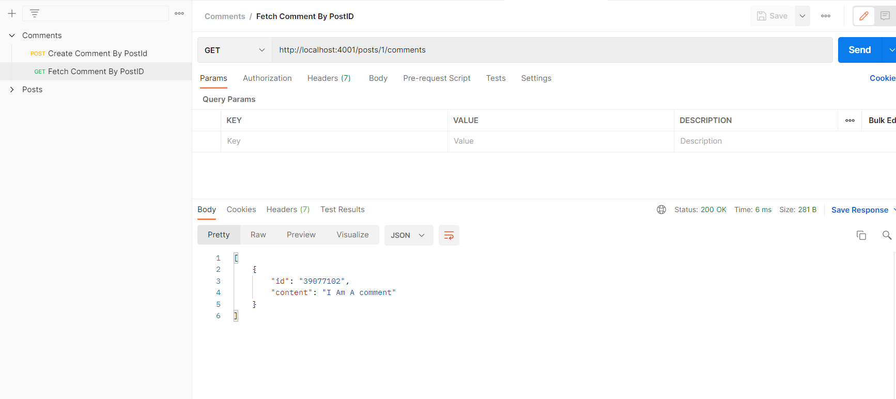

I think that we're going to have two different route handlers.
Once again, we're going to have one handler that's going to allow us to create a new comment that is
associated with some very particular post.

So you'll notice that inside the path right here, we're going to make a request to post slash and then
the idea of the post that we're going to associate this comment with.

When we make a post request, we're going to have a body that has a content that is some string, so
content is going to be the actual text of the content itself.

We're then going to have a second router handler that's going to give us all of the different comments
that are associated with some very particular post ID.

So make a get request to that route that will give us all the comments associated with some given post id, it's a pretty straightforward, but we are going to have just a little bit more complexity on
the service.

*commentsByPostId Data Structure*
 
;

#### Create a Comment

#### Fetch comments by PostID
